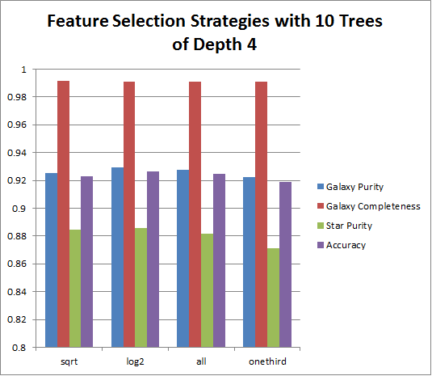

#Feature Selection Strategy
We compared different Feature Subset Strategies for the Random Forest Classifier found in MLlib for Spark. The task was Star-Galaxy classification of CFHTLenS data.

MLlib only allows input of strings: "auto", "sqrt", "log2", "all", and "onethird".
In our case, "auto" is the same as "sqrt" because we are using more than 1 tree. 
With only one tree, "auto" is the same as "all".

These metrics were averaged over 5 trials each. The data from which each graph was generated is displayed below each graph.

| selection   strategy | Galaxy Purity | Galaxy Completeness | Star Purity | Star Completeness | Accuracy |
|----------------------|---------------|---------------------|-------------|-------------------|----------|
| sqrt                 | 0.925411      | 0.991616            | 0.884379    | 0.444111          | 0.922775 |
| log2                 | 0.92931       | 0.991115            | 0.885649    | 0.475721          | 0.926311 |
| all                  | 0.927423      | 0.991115            | 0.881842    | 0.460697          | 0.924422 |
| onethird             | 0.922473      | 0.990873            | 0.871172    | 0.420313          | 0.919133 |

| selection strategy | Galaxy Purity | Galaxy Completeness | Star Purity | Star Completeness | Accuracy    |
|--------------------|---------------|---------------------|-------------|-------------------|-------------|
| sqrt               | 0.968837798   | 0.989760799         | 0.915442379 | 0.776839566       | 0.963177711 |
| log2               | 0.976568222   | 0.98891757          | 0.914840539 | 0.833655006       | 0.969533133 |
| all                | 0.981661075   | 0.986508346         | 0.902098941 | 0.870808203       | 0.972063253 |
| onethird           | 0.97088537    | 0.989674755         | 0.916373967 | 0.791917973       | 0.96498494  |

| selection   strategy | Galaxy Purity | Galaxy Completeness | Star Purity | Star Completeness | Accuracy |
|----------------------|---------------|---------------------|-------------|-------------------|----------|
| sqrt                 | 0.924606      | 0.991971            | 0.886268    | 0.435301          | 0.922221 |
| log2                 | 0.924563      | 0.992005            | 0.886865    | 0.434943          | 0.922206 |
| all                  | 0.927863      | 0.986811            | 0.840182    | 0.464162          | 0.921324 |
| onethird             | 0.922642      | 0.992637            | 0.890975    | 0.418962          | 0.920756 |

| selection   strategy | Galaxy Purity | Galaxy Completeness | Star Purity | Star Completeness | Accuracy |
|----------------------|---------------|---------------------|-------------|-------------------|----------|
| sqrt                 | 0.968077      | 0.991001            | 0.924928    | 0.772368          | 0.963553 |
| log2                 | 0.97412       | 0.990847            | 0.927617    | 0.816627          | 0.968974 |
| all                  | 0.980228      | 0.986708            | 0.902969    | 0.861364          | 0.970972 |
| onethird             | 0.968245      | 0.991173            | 0.926404    | 0.773565          | 0.963853 |

From this, we conclude that log2 is the optimal Feature Selection Strategy for these data. 
